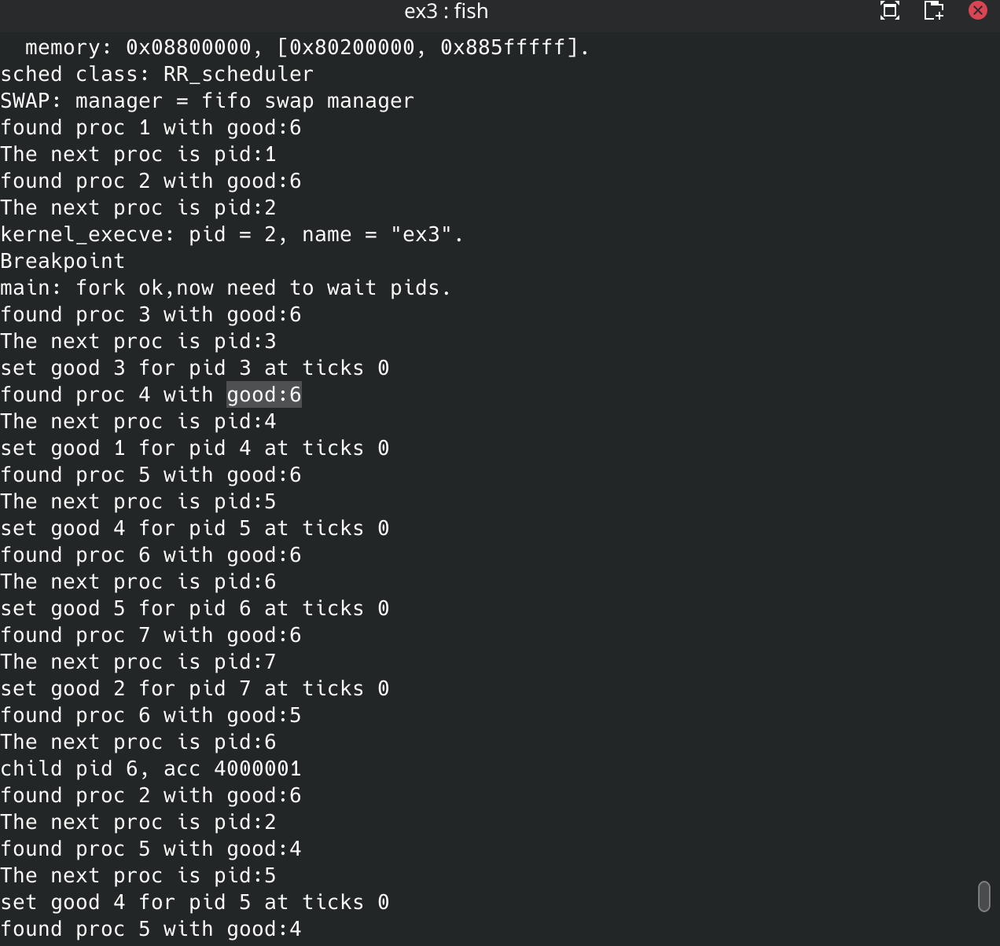
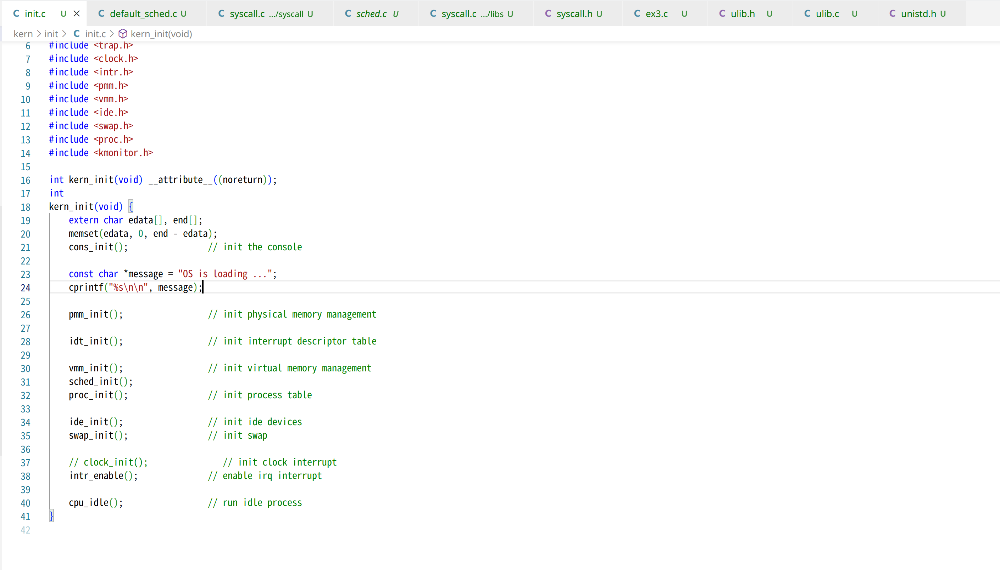
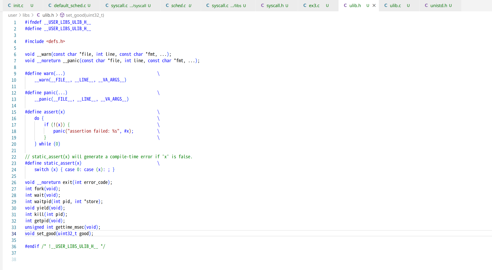
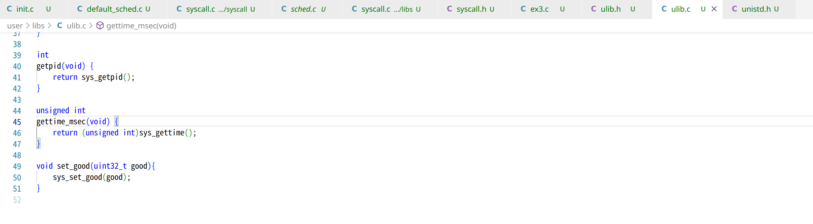
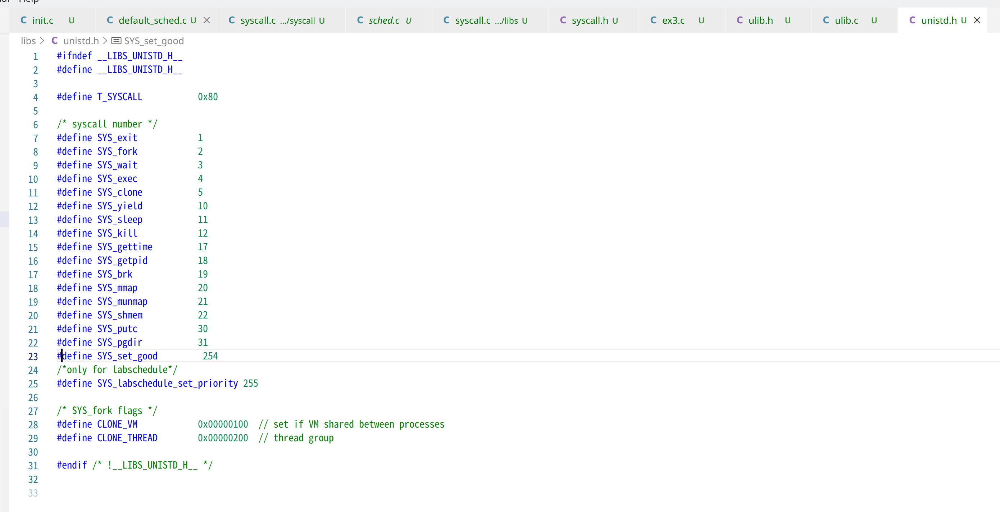

ass4

Q1:

| Time                  | HRRN | FIFO/FCFS | RR   | SJF  | PRiority |
| --------------------- | ---- | --------- | ---- | ---- | -------- |
| 1                     | A    | A         | A    | A    | A        |
| 2                     | A    | A         | B    | A    | B        |
| 3                     | A    | A         | A    | A    | A        |
| 4                     | A    | A         | D    | A    | D        |
| 5                     | B    | B         | C    | B    | D        |
| 6                     | D    | D         | A    | D    | C        |
| 7                     | D    | D         | D    | D    | C        |
| 8                     | C    | C         | C    | C    | C        |
| 9                     | C    | C         | A    | C    | A        |
| 10                    | C    | C         | C    | C    | A        |
| Avg. Turn-around Time | 4.5  | 4.5       | 5    | 4.5  | 4.75     |

Q2:
modify `RR_pick_next` to choose process with the max good value

