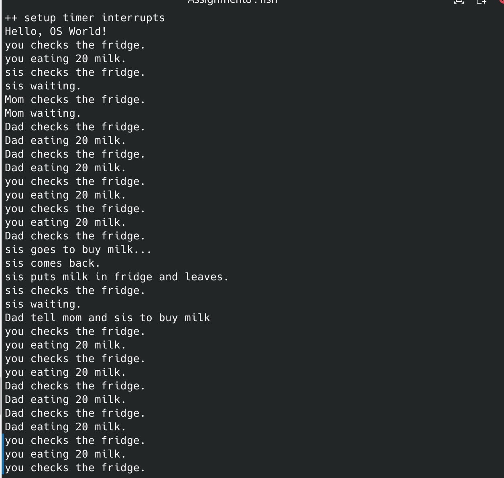

1. polling:
   
    Pros:  1. simple to implement

         2. maybe more efficient when a device is frequently reached and checked

     Cons: 1. consumes cpu time waiting for io
          	  2.  may make the system response late
    
    
    
    Interrupt-based I/O:
     Pros: 1. Allow cpu to perform other tasks when waiting for io
    
                   2. system can response to other events when waiting for io
    
     cons: 1. more complex to implement
                2. if the device is frequently reached, the context switch will cost more time than waiting

2. | PIO                                                    | DMA                                                          |
   | ------------------------------------------------------ | ------------------------------------------------------------ |
   | cpu directly controls the tranfer of data              | a independent controller from cpu                            |
   | perform data tranfer and wait for io or context switch | faster, allow cpu to perform other tasks                     |
   | do not need additional hardware                        | requires additional hardware and software to manage data transfer |
   | can be used for almost all devices                     | limited to devices supporting DMA transfers                  |

3. 

   1. limit user level access to memory, only allow privileged processes directly access devices

   2. hardware protection: some devices provides a privileged bit to indicate the identity of access
   3. Input validation: check the invalidation of the input params and ensure they are in their range


programming

I have referred to tsinghua's guide of ucore: https://nankai.gitbook.io/ucore-os-on-risc-v64/lab7/tiao-jian-bian-liang-yu-guan-cheng

So, we need a monitor to monitor which process is waiting for this condvar and need to be signaled. 

```c
typedef struct monitor monitor_t;

typedef struct condvar{
//================your code=====================
    semaphore_t sem;       
    int count;  
    monitor_t *owner;            
} condvar_t;

typedef struct monitor {
//================your code=====================
    semaphore_t mutex;
    semaphore_t next;
    int next_count;     
    condvar_t *cv;  
} monitor_t;
```

the mutex in struct monitor is used to ensure that modification to monitor is atomic and next indicates the other process waiting.

Because we only have one condvar, so the init can only init condvar.

```c
void     
cond_init (condvar_t *cvp) {
    monitor_t * mtp = (monitor_t *)kmalloc(sizeof(monitor_t));
    mtp->next_count = 0;
    mtp->cv = cvp;
    sem_init(&(mtp->mutex), 1);
    sem_init(&(mtp->next), 0);
    cvp->count = 0;
    cvp->owner = mtp;
    sem_init(&(cvp->sem), 0);
}
```

We set the next of the monitor to 0 for that if we find if the next is not fit, we will wait for it and mutex to 1 for it was not locked when init.

```c
void
cond_wait (condvar_t *cvp, semaphore_t *mutex) {
    // cprintf("cond_wait begin:  cvp %x, cvp->count %d, cvp->owner->next_count %d\n", cvp, cvp->count, cvp->owner->next_count);
    /*
     *         cv.count ++;
     *         if(mt.next_count>0)
     *            signal(mt.next)
     *         else
     *            signal(mt.mutex);
     *         wait(cv.sem);
     *         cv.count --;
     */

    cvp->count++;
    if(cvp->owner->next_count > 0)
        up(&(cvp->owner->next));
    else
        up(&(cvp->owner->mutex));
    up(mutex);
    down(&(cvp->sem));
    cvp->count --;

    // cprintf("cond_wait end:  cvp %x, cvp->count %d, cvp->owner->next_count %d\n", cvp, cvp->count, cvp->owner->next_count);
}   
```

The cond_wait is, first add the count waiting for this condvar, and signal to the thread in monitor's next, if not other thread is waiting, we repease the lock and wait for the condvar.

```c
void 
cond_signal (condvar_t *cvp) {
    // cprintf("cond_signal begin: cvp %x, cvp->count %d, cvp->owner->next_count %d\n", cvp, cvp->count, cvp->owner->next_count);
    /*
     *      cond_signal(cv) {
     *          if(cv.count>0) {
     *             mt.next_count ++;
     *             signal(cv.sem);
     *             wait(mt.next);
     *             mt.next_count--;
     *          }
     *       }
     */
    if(cvp->count>0) {
        cvp->owner->next_count ++;
        up(&(cvp->sem));
        down(&(cvp->owner->next));
        cvp->owner->next_count --;
    }
    // cprintf("cond_signal end: cvp %x, cvp->count %d, cvp->owner->next_count %d\n", cvp, cvp->count, cvp->owner->next_count);
}
```

The cond_signal is if other threads is blocked in this condvar, first we add the counting and wake the blocking thread. Then we wait for that thread to wake us. Then we minus the count.


