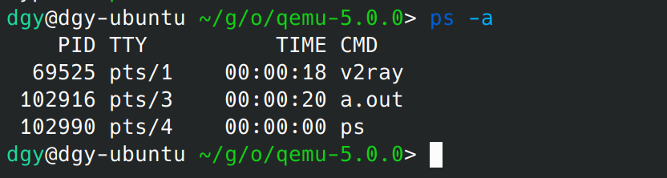
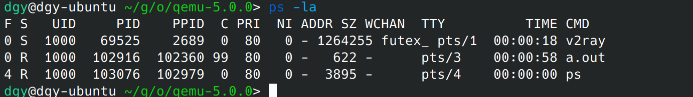
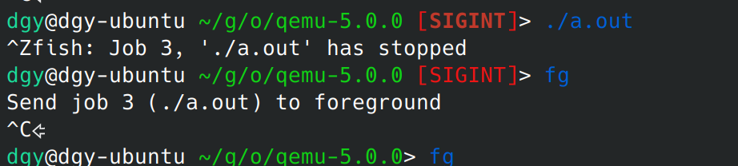
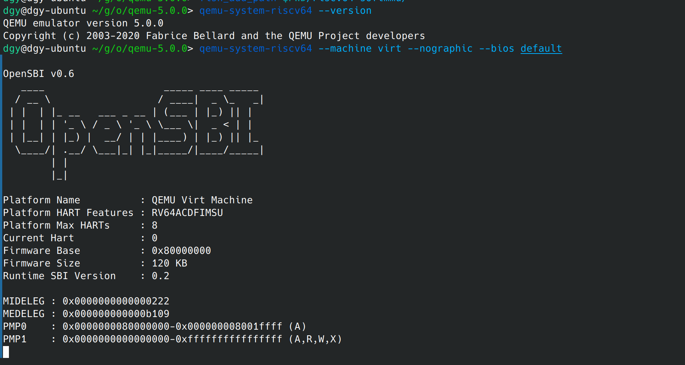
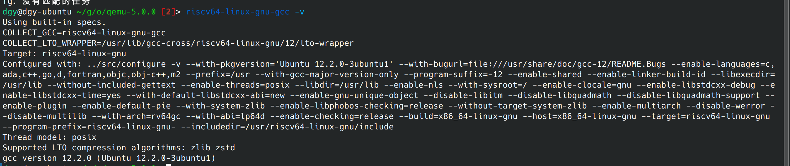

1. username@hostname:current dic  cd 
2. mv origin dest
3. find . -name "*.c"
4. change the file permission of test.txt to 537 (r-x-wxrwx)
5. 

6. 

7. ctrl a + x
8. 
9. pdf 0
10. 不允许，都会，1次当次0 2次课程0 无保研（）