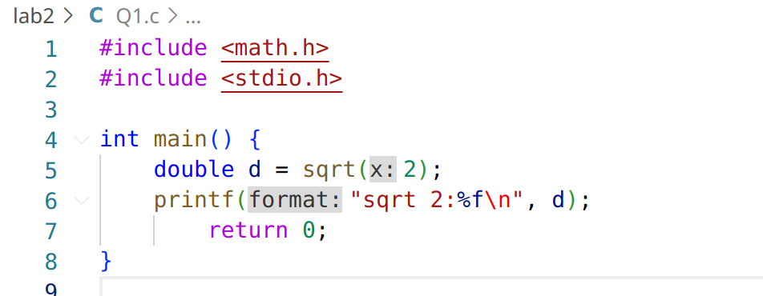
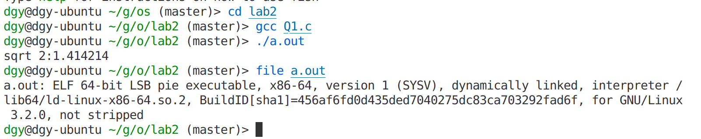
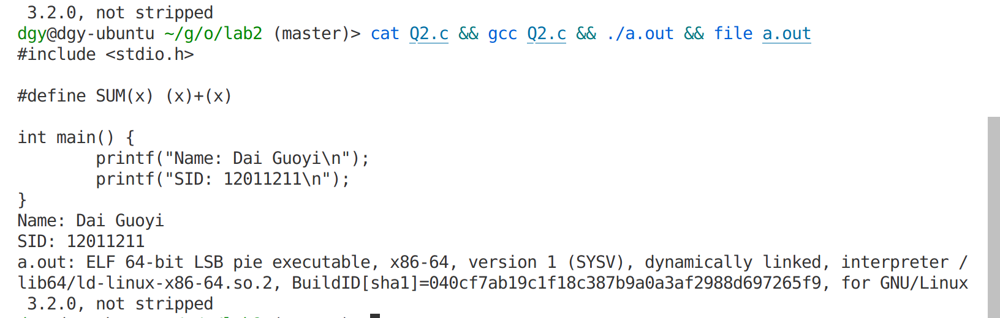
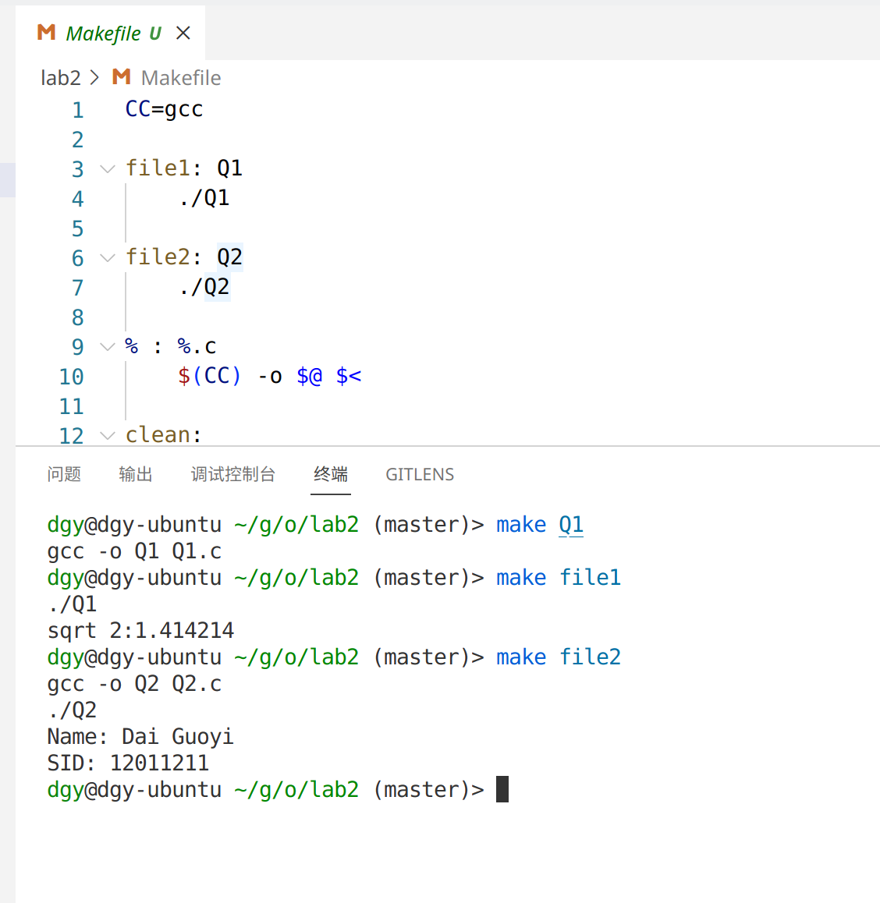
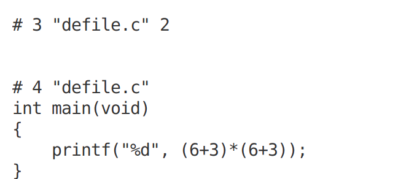
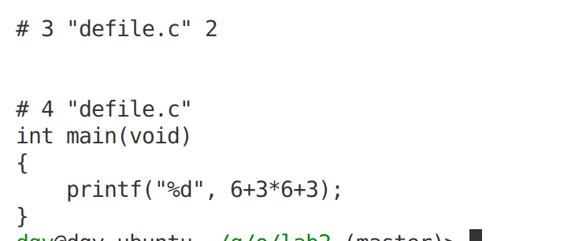

lab2 

Q1:

Q2:

Q3:

preprocess c file and header files, compile c files into objcet files, then link object files and static library together 

Q4:

Windows is PE（Portable Executable）and Linux is ELF（Executable Linkable Format）

Q5:

Q6:

\#define MUL(x) (x)*(x) 

将宏文件展开

81

Q7：

\#define MUL(x) (x)*(x) 

27

