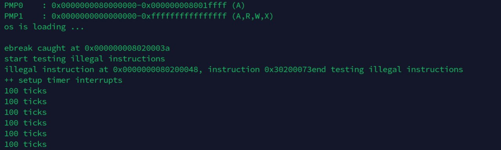
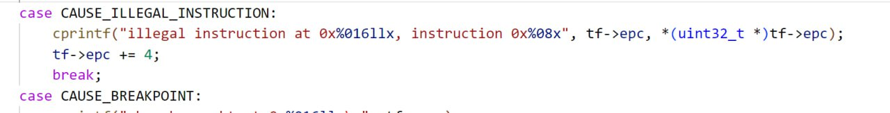
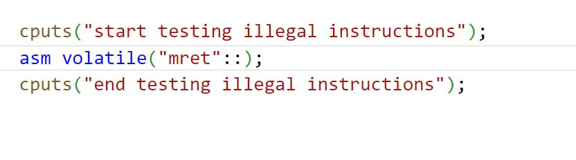

1. save context, handle exception/interrupt, restore context and return.

2. When a trap is taken into S-mode, sepc is written with the virtual address of the instruction that was interrupted or that encountered the exception. When return from trap, xRET sets the pc to the value stored in the xepc register.

3. 

  

