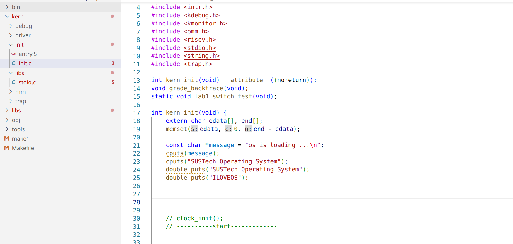
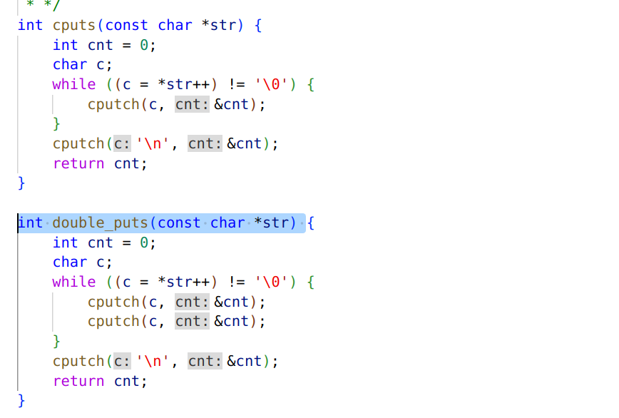
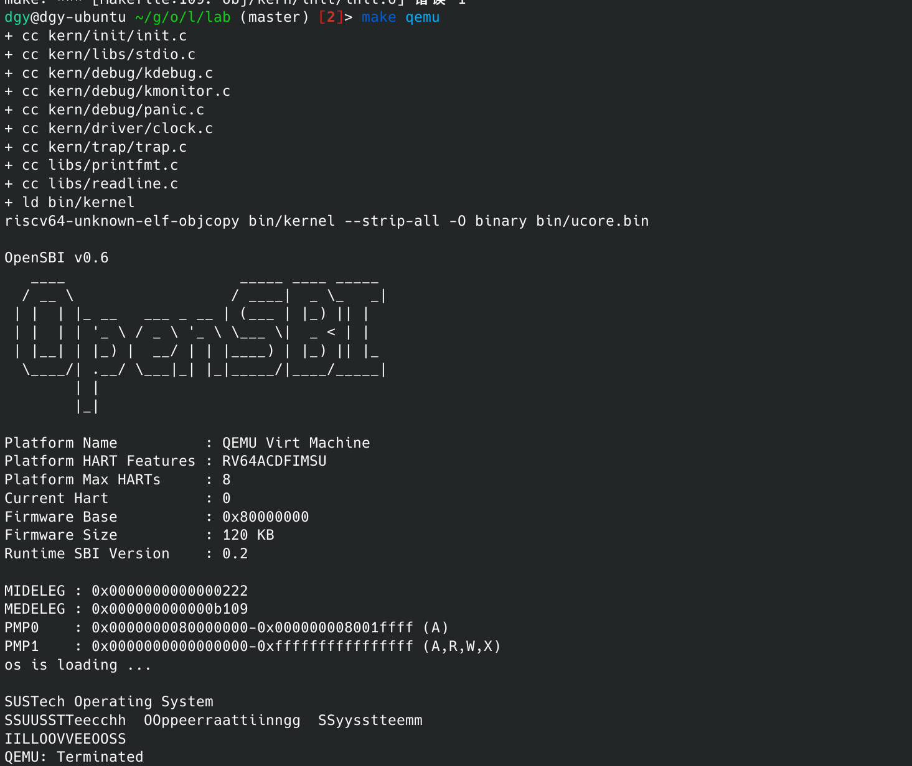

1. cpu电复位，跳转pc至 `0x80200000` 开始执行第一行代码， `.text`,`.kern_entry`被`linker`定位到`0x802000000`,初始化`stack pointer`，跳转到`kern_init`

2. `elf`是一种描述可执行文件的数据结构，`bin`文件是简单的`memory layout`

3. 链接脚本规定了`sections`和`labels`从哪里以及按照什么顺序进行排列

4. 5 一起做了

   

   

   